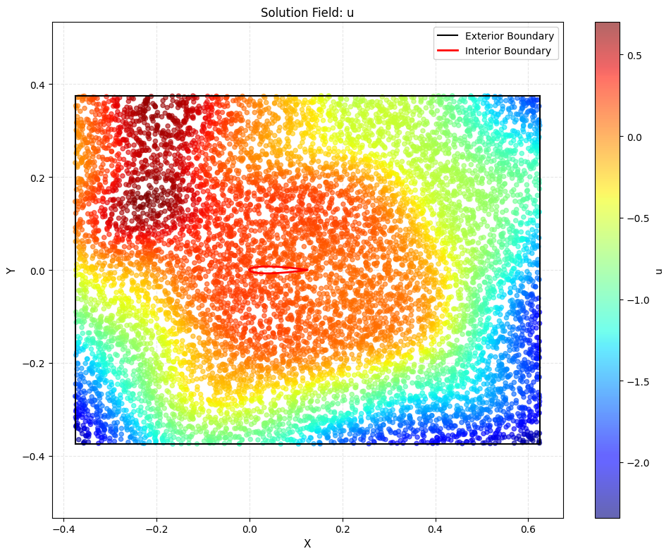
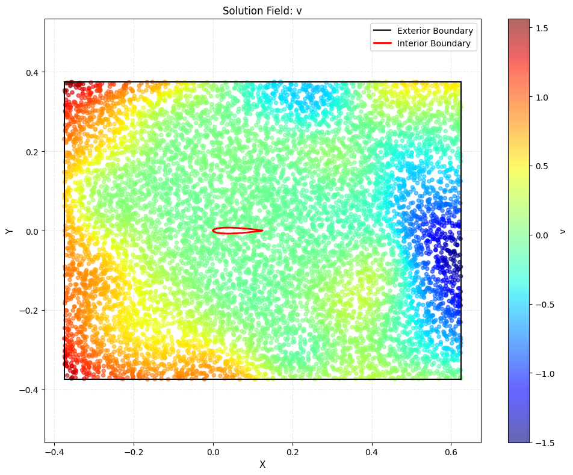
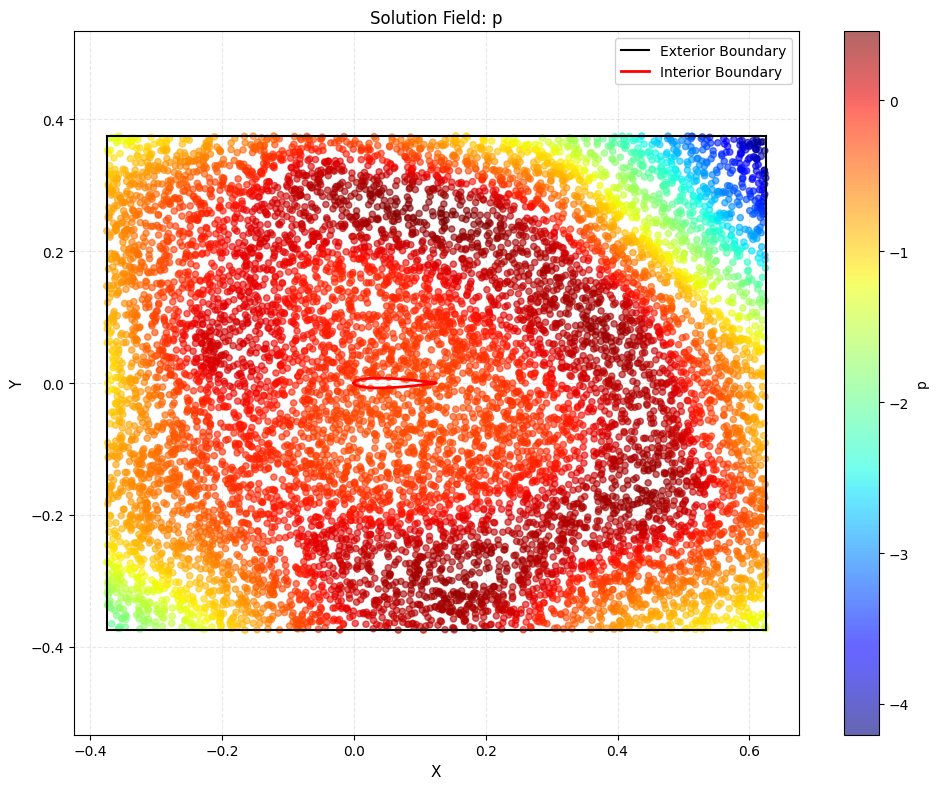

# Table of Contents
- [Flowinn_torch](#flowinn_torch)
- [What's new in the PyTorch Version?](#whats-new-in-the-pytorch-version)
- [My Experiments From This Repo](#my-experiments-from-this-repo)
- [Examples](#airfoil-example)

# Flowinn_torch
`Flowinn_torch` is the PyTorch version of the Fl0wINN repository orignially created by Jon Errasti Odriozola in tensorflow (it can be found here: https://github.com/errasti13)

# What's new in the PyTorch Version?
- The original fl0winn uses Modified Fourier Network. In this repo I have incorporated 3 additional architectures which are
    - `SimpleMLP`: A simple MLP model 
    - `SimpleMLPResidual`: A MLP model with Residual Blocks
    - `SimpleConv1dResidualNet`: A 1D convolution network with residual blocks

## My Experiments and Learnings
- The approach taken in fl0winn is completely unsupervised, meaning there is no need for training data since a PINN based CFD loss functions should theoretically solve the problem
- However, this approach does not seem to be feasible even for the simple airfoil example. All the architectures get stuck in a plateau where the loss function stop decreasing. 
- Techniques such as learning rate schedulers, dropout, and batch normalization were applied, but the loss still does not converge to zero (or even close).

# Installation
Before installing `flowinn_torch`, 

- Make sure to create a new environment in python, 

```python
conda create --name flowinn_torch -c conda-forge python=3.11
```

- Install latest PyTorch version (2.7.0) using 
```python
pip3 install torch torchvision torchaudio --index-url https://download.pytorch.org/whl/cu118
```

- Install latest numpy and scipy versions 
```python
pip3 install numpy scipy
```
- Now go the flowinn_torch directory and install it using 
```python
pip install -e .
```

# Airfoil Example
This is a simulation of 2D flow over an airfoil. The jupyter notebook can be found inside `jupyterNotebook/` directory. The result after 10,000 epochs still has non-zero residual in the order of $10^{-1}$ 


